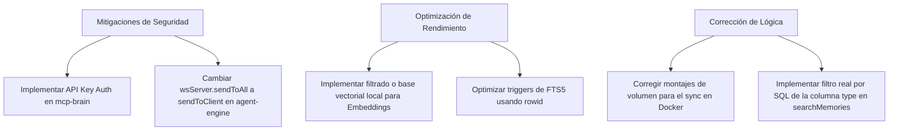

# Informe de Auditoría Completa de Código — LaLlamaOllama

Este informe resume los resultados de una auditoría exhaustiva realizada sobre la base de código del proyecto **LaLlamaOllama**. El análisis abarca la arquitectura del sistema, la dockerización, la seguridad y privacidad, el rendimiento, la consistencia de datos, la lógica del negocio y el cumplimiento de las directivas de formato y linter establecidas para el desarrollo del ecosistema.

---

## 1. Estructura y Arquitectura del Proyecto

El proyecto está diseñado bajo una arquitectura de microservicios distribuidos en contenedores Docker y organizados de la siguiente forma:

1. **`backend`**: Servidor Express 4 + TypeScript (NodeNext). Actúa como proxy para Ollama y el catálogo de herramientas de MCP, implementa rate limiting, autenticación por API Key y telemetría de hardware/Ngrok.
2. **`mcp-brain`**: Servidor Express + SQLite (FTS5 + embeddings). Almacena y busca memorias semánticas/léxicas, gestiona directivas del proyecto, y expone interfaces MCP y REST.
3. **`agent-engine`**: Agente autónomo de codificación Express 4 + TypeScript + better-sqlite3 + BullMQ + Redis. Registra herramientas, gestiona chats y corre ejecuciones en segundo plano.
4. **`frontend`** y **`agent-frontend`**: Clientes web React 19 + Vite 7 que interactúan con el backend y el motor de agentes.

---

## 2. Hallazgos Críticos de Seguridad y Privacidad

> [!CAUTION]
> ### 1. Exposición y Falta de Autenticación en la API de `mcp-brain` (Puerto 3015)
> **Severidad:** Crítica  
> **Detalle:** A diferencia de `backend`, el servicio `mcp-brain` expone todos sus endpoints REST (`/api/memory`, `/api/directives`, `/api/projects/merge`, etc.) de forma completamente pública y sin validar ninguna API Key. Aunque en `docker-compose.yml` se menciona una variable comentada para seguridad, la implementación real en `mcp-brain/src/server/api.ts` carece de middleware de autenticación.
> **Impacto:** Si el puerto `3015` es accesible en la red local o expuesto accidentalmente mediante Ngrok, cualquier atacante puede leer, modificar o eliminar todas las memorias persistentes, las directivas centrales (lo cual permite secuestrar las instrucciones de los agentes de IA) y configurar integraciones de IDEs.

> [!WARNING]
> ### 2. Fuga de Datos en Tiempo Real vía WebSocket en `agent-engine` (`wsServer.sendToAll()`)
> **Severidad:** Alta (Privacidad de Datos)  
> **Detalle:** En `agent-engine/src/server/handlers.ts`, los callbacks del flujo del agente (`onChunk`, `onToolCall`, `onToolResult`, `onStatus`, `list_chats` y `telegram_message`) utilizan la función `wsServer.sendToAll()` para transmitir los datos al frontend.
> **Impacto:** En un entorno multiusuario (o si se comparte el acceso al dashboard remotamente), todos los usuarios conectados al WebSocket verán en tiempo real la salida de los chats, los resultados de las herramientas (que pueden contener contraseñas, listados de código y directorios) y las sugerencias de los demás usuarios. La comunicación debe restringirse usando `sendToClient()` o a través de salas específicas por sesión/usuario.

> [!NOTE]
> ### 3. Restricciones Débiles en la Ejecución de Comandos (`bash.ts`)
> **Severidad:** Media  
> **Detalle:** El linter de comandos de `bash.ts` solo bloquea patrones específicos muy acotados (como `rm -rf /`, `mkfs.*`, `dd`, fork bombs y redirección directa a `/dev/sda`). No realiza validaciones sobre acceso a rutas externas al workspace (por ejemplo, `cat /etc/passwd` o modificar archivos del sistema operativo del contenedor).
> **Impacto:** El contenedor en sí funciona como sandbox principal. Sin embargo, un agente mal instruido o comprometido tiene control total sobre el contenedor de Docker y los servicios de red internos (incluyendo la comunicación directa a Redis u Ollama sin trabas).

---

## 3. Hallazgos de Lógica de Negocio e Integración

> [!IMPORTANT]
> ### 4. Sincronización Automática MCP (`/api/mcp/sync`) No Funciona en Contenedores Docker
> **Severidad:** Alta (Funcionalidad rota)  
> **Detalle:** El endpoint `/api/mcp/sync` en `mcp-brain` lee `os.homedir()` para escribir las configuraciones de Claude Desktop y RooCode (ej. `AppData/Roaming/Claude/claude_desktop_config.json`). Bajo Docker, `os.homedir()` devuelve `/root` dentro del contenedor. Como el contenedor de `mcp-brain` solo tiene montado el directorio de datos `./data`, las escrituras ocurren de forma aislada dentro del sistema de archivos interno del contenedor y nunca se sincronizan con las aplicaciones instaladas en la máquina host del desarrollador.
> **Impacto:** La sincronización con un clic desde el dashboard hacia Claude Desktop y RooCode falla de manera silenciosa, creando carpetas inútiles dentro del contenedor Docker de la base de datos.

> [!WARNING]
> ### 5. Filtro por Tipo de Memoria (`type`) Ineficaz en `knowledge_search`
> **Severidad:** Alta (Defecto lógico)  
> **Detalle:** En `agent-engine/src/services/tools/knowledge-search.ts`, el argumento opcional `type` concatena un prefijo a la consulta (`type:feature query`). Sin embargo, en `mcp-brain/src/services/memories/searchMemories.ts`, la consulta semántica (embeddings) e híbrida ignora por completo la extracción de este prefijo para realizar un filtro SQL. Además, la tabla virtual FTS5 (`memories_fts`) no indexa la columna `type`, lo que hace que las consultas léxicas tampoco puedan realizar dicho filtrado de manera efectiva, contaminando el cálculo del vector y los resultados.

> [!IMPORTANT]
> ### 6. Modelo de Embeddings Hardcodeado en el Cerebro
> **Severidad:** Media (Riesgo de fallo silencioso)  
> **Detalle:** En `mcp-brain/src/services/config.ts`, la propiedad `embeddingModel` está definida estáticamente como `"qwen3.5:4b-12k"`.
> **Impacto:** Si el usuario no tiene descargado exactamente este modelo en su motor Ollama, cualquier intento de generar memorias semánticas o buscar en ellas fallará silenciosamente, degradando la base de conocimiento completa a búsqueda de texto plano (léxica) sin alertar al usuario en el frontend.

> [!IMPORTANT]
> ### 7. Bloqueo de la Limpieza del Workspace (`cleanWorkspace`) por Volumen de Solo Lectura
> **Severidad:** Media (Fallo del sistema de archivos)  
> **Detalle:** El servicio `backend` en `docker-compose.yml` monta el volumen `ollama_data` en modo de solo lectura: `ollama_data:/root/.ollama:ro`. Sin embargo, el endpoint `/api/models/clean` ejecuta la función `cleanWorkspace()`, la cual intenta borrar físicamente archivos antiguos del directorio `/root/.ollama/models/blobs` usando `fs.unlinkSync()`.
> **Impacto:** Al ejecutarse en un volumen read-only, el comando fallará invariablemente con un error `EROFS: read-only file system`, impidiendo la limpieza del disco.

---

## 4. Cuellos de Botella de Rendimiento y Escalabilidad

> [!WARNING]
> ### 8. Cuello de Botella Crítico en Búsqueda Semántica
> **Severidad:** Alta (Escalabilidad O(N))  
> **Detalle:** En `mcp-brain/src/services/memories/searchMemories.ts` (línea 105), la búsqueda semántica e híbrida realiza un SELECT global de todas las memorias del proyecto (`SELECT ... FROM memories WHERE project = ? AND vector IS NOT NULL`), carga en memoria de Javascript todos los JSON que representan los vectores, realiza un bucle en JS parseando el string con `JSON.parse(row.vector)` y ejecuta el cálculo de la similitud del coseno fila por fila.
> **Impacto:** A medida que el proyecto aumente su cantidad de memorias (cientos o miles de registros), este proceso degradará severamente la latencia de respuesta del agente, consumirá ciclos de CPU masivos e incrementará el uso de memoria RAM del microservicio de forma exponencial.

> [!WARNING]
> ### 9. Trigger Ineficiente en Tabla Virtual FTS5 (`memories_fts`)
> **Severidad:** Media  
> **Detalle:** El trigger de actualización y eliminación de memorias en `mcp-brain/src/database/schemas/memories.ts` busca los registros correspondientes usando la expresión `WHERE id = new.id` (o `WHERE id = old.id`). Puesto que la columna `id` está definida con el modificador `UNINDEXED` en la tabla virtual de FTS5, SQLite se ve forzado a realizar un escaneo secuencial completo de la tabla virtual FTS5 para encontrar el elemento a actualizar o borrar.
> **Impacto:** Ralentización innecesaria al actualizar o borrar memorias desde el agente. Se recomienda buscar por `rowid` (por ejemplo: `WHERE rowid = old.rowid` o `WHERE rowid = (SELECT rowid FROM memories WHERE id = old.id)`).

> [!NOTE]
> ### 10. Watcher Innecesario de Métricas de GPU (`nvidia-smi` en bucle)
> **Severidad:** Baja  
> **Detalle:** En `backend/src/ollama/ollama.service.ts`, un intervalo en segundo plano ejecuta cada 3 segundos el comando `nvidia-smi` usando `exec()`. En entornos donde no hay GPU NVIDIA (por ejemplo, Mac, procesadores con AMD, o despliegues CPU-only), el comando falla repetidamente. Aunque el error es ignorado de forma silenciosa en el código, la creación y destrucción recurrente de subprocesos cada 3 segundos representa una sobrecarga de CPU evitable.

---

## 5. Cumplimiento de Reglas del Proyecto (Estilo y Biome)

### Biome Linter & Formatter
De acuerdo con las reglas definidas en `biome.json` (raíz), la indentación configurada debe ser mediante **tabs** y se deben utilizar comillas **dobles** para Javascript/TypeScript.
* **Incumplimiento:** El módulo de `backend` (incluyendo `backend/src/main.ts`, `backend/src/app.module.ts` y las carpetas de middlewares) ha sido desarrollado utilizando indentación de **2 espacios** en lugar de tabs. Esto genera advertencias de estilo de Biome que impiden pasar la validación global `npx biome check .` limpia.
* **Consistencia:** El módulo `agent-engine` y `mcp-brain` sí utilizan tabs de forma correcta en sus archivos fuente.

---

## 6. Plan de Acción y Recomendaciones

Para solucionar los problemas identificados y garantizar un sistema robusto, escalable y seguro, se proponen las siguientes acciones de mitigación:

### Acciones Corto Plazo (Inmediato)
1. **Autenticación en el Cerebro:** Agregar el middleware de autenticación por API Key en `mcp-brain/src/server/api.ts` (importándolo o leyéndolo de las variables de entorno de la misma forma que en el backend).
2. **Seguridad del WebSocket:** Modificar `agent-engine/src/server/handlers.ts` para que los mensajes de streaming (`assistant_chunk`, `tool_call`, `tool_result` y `assistant_done`) solo se envíen al cliente WebSocket propietario de la petición utilizando `wsServer.sendToClient(clientId, ...)` en lugar de realizar un broadcast a todos con `sendToAll()`.
3. **Limpieza de Blobs:** Cambiar el volumen del backend en `docker-compose.yml` a modo de lectura/escritura (`ollama_data:/root/.ollama` sin el sufijo `:ro`) si se requiere que la función de limpieza de disco sea operativa, o en su defecto desactivar el botón en la interfaz si se prefiere blindar el volumen de Ollama.
4. **Filtro de Búsqueda Semántica:** Modificar `searchMemories.ts` para que extraiga el parámetro `type` enviado por el agente y aplique un filtro a nivel de consulta SQL (`AND type = ?`) antes de calcular similitudes de coseno en Javascript, evitando así contaminar el embedding.

### Acciones Medio Plazo (Escalabilidad)
1. **Indexación Vectorial:** Al crecer el número de memorias, reemplazar el cálculo in-memory de la similitud del coseno en Javascript por una base de datos vectorial liviana (como `sqlite-vss` de SQLite o realizar pre-filtros más estrictos por fecha/proyecto antes del procesamiento de vectores).
2. **Optimización de Triggers:** Corregir los triggers de `memories_fts` en `memories.ts` para que utilicen `rowid` para las cláusulas de actualización y eliminación.
3. **Sincronización MCP:** Diseñar un mecanismo alternativo para la auto-sincronización de IDEs (por ejemplo, permitir exportar la configuración en un archivo descargable desde la UI del frontend para que el usuario la mueva a su carpeta de host local).
